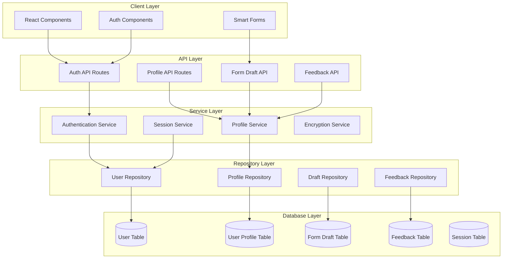
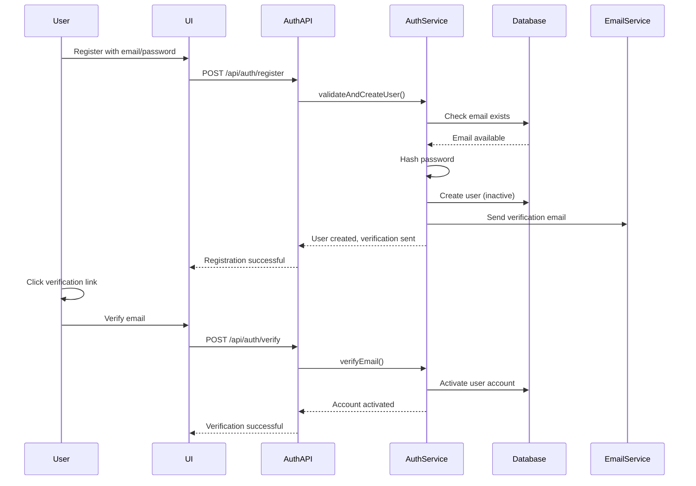

# User Authentication and Profile Management System - Design Document

## Overview

The User Authentication and Profile Management System provides secure user registration, login, session management, and profile management capabilities for the LegalOps platform. This system integrates seamlessly with existing Phase 7 components including Smart Forms, Risk Assessment, and the Liquid Glass design system to enable personalized user experiences, auto-fill functionality, and proper data persistence.

The system builds upon the existing User model in the database and extends it with authentication services, profile management, and integration with form drafts and feedback systems that currently use in-memory storage.

## Architecture

### High-Level Architecture



### Authentication Flow



## Components and Interfaces

### Core Services

#### IAuthenticationService
```typescript
interface IAuthenticationService extends IService {
  register(email: string, password: string, userData: RegisterData): Promise<Result<User>>;
  login(email: string, password: string): Promise<Result<AuthSession>>;
  logout(sessionId: string): Promise<Result<void>>;
  verifyEmail(token: string): Promise<Result<User>>;
  requestPasswordReset(email: string): Promise<Result<void>>;
  resetPassword(token: string, newPassword: string): Promise<Result<void>>;
  validateSession(sessionId: string): Promise<Result<AuthSession>>;
}
```

#### IProfileService
```typescript
interface IProfileService extends IService {
  getProfile(userId: string): Promise<Result<UserProfile>>;
  updateProfile(userId: string, profileData: ProfileData): Promise<Result<UserProfile>>;
  getAutoFillData(userId: string, formType: string): Promise<Result<AutoFillData>>;
  saveAutoFillData(userId: string, data: AutoFillData): Promise<Result<void>>;
  deleteProfile(userId: string): Promise<Result<void>>;
  exportUserData(userId: string): Promise<Result<UserDataExport>>;
}
```

#### ISessionService
```typescript
interface ISessionService extends IService {
  createSession(userId: string, metadata: SessionMetadata): Promise<Result<AuthSession>>;
  validateSession(sessionId: string): Promise<Result<AuthSession>>;
  refreshSession(sessionId: string): Promise<Result<AuthSession>>;
  invalidateSession(sessionId: string): Promise<Result<void>>;
  invalidateAllUserSessions(userId: string): Promise<Result<void>>;
  cleanupExpiredSessions(): Promise<Result<number>>;
}
```

### Repository Interfaces

#### IUserRepository
```typescript
interface IUserRepository extends IRepository<User> {
  findByEmail(email: string): Promise<Result<User | null>>;
  findByVerificationToken(token: string): Promise<Result<User | null>>;
  findByPasswordResetToken(token: string): Promise<Result<User | null>>;
  updatePassword(userId: string, hashedPassword: string): Promise<Result<void>>;
  activateUser(userId: string): Promise<Result<void>>;
  deactivateUser(userId: string): Promise<Result<void>>;
  getUsersForAdmin(filters: AdminUserFilters): Promise<Result<PaginatedResponse<User>>>;
}
```

#### IUserProfileRepository
```typescript
interface IUserProfileRepository extends IRepository<UserProfile> {
  findByUserId(userId: string): Promise<Result<UserProfile | null>>;
  updateAutoFillData(userId: string, formType: string, data: AutoFillData): Promise<Result<void>>;
  getAutoFillData(userId: string, formType: string): Promise<Result<AutoFillData | null>>;
  deleteUserData(userId: string): Promise<Result<void>>;
}
```

### Authentication Components

#### LoginForm Component
```typescript
interface LoginFormProps {
  onSuccess?: (user: User) => void;
  onError?: (error: string) => void;
  redirectTo?: string;
  className?: string;
}
```

#### RegisterForm Component
```typescript
interface RegisterFormProps {
  onSuccess?: (user: User) => void;
  onError?: (error: string) => void;
  className?: string;
}
```

#### ProfileManager Component
```typescript
interface ProfileManagerProps {
  userId: string;
  onProfileUpdate?: (profile: UserProfile) => void;
  className?: string;
}
```

## Data Models

### Enhanced User Model (extends existing)
```typescript
interface User {
  // Existing fields from Prisma schema
  id: string;
  email: string;
  passwordHash: string;
  firstName?: string;
  lastName?: string;
  phone?: string;
  userType: UserType;
  role: UserRole;
  isActive: boolean;
  createdAt: Date;
  updatedAt: Date;
  
  // New authentication fields
  emailVerified: boolean;
  emailVerificationToken?: string;
  emailVerificationExpires?: Date;
  passwordResetToken?: string;
  passwordResetExpires?: Date;
  lastLoginAt?: Date;
  loginAttempts: number;
  lockedUntil?: Date;
  
  // Profile relationship
  profile?: UserProfile;
}
```

### UserProfile Model (new)
```typescript
interface UserProfile {
  id: string;
  userId: string;
  
  // Personal Information
  personalInfo: {
    firstName?: string;
    lastName?: string;
    middleName?: string;
    dateOfBirth?: Date;
    ssn?: string; // Encrypted
    phone?: string;
    alternatePhone?: string;
  };
  
  // Address Information
  addresses: {
    personal?: Address;
    mailing?: Address;
    business?: Address;
  };
  
  // Business Information
  businessInfo: {
    companyName?: string;
    title?: string;
    industry?: string;
    businessPhone?: string;
    businessEmail?: string;
    fein?: string;
    businessType?: string;
  };
  
  // Auto-fill preferences
  autoFillPreferences: {
    enableAutoFill: boolean;
    verifiedFields: string[];
    lastAutoFillUpdate: Date;
  };
  
  // Privacy preferences
  privacySettings: {
    allowDataExport: boolean;
    allowMarketing: boolean;
    allowAnalytics: boolean;
    dataRetentionDays?: number;
  };
  
  createdAt: Date;
  updatedAt: Date;
}
```

### AuthSession Model (new)
```typescript
interface AuthSession {
  id: string;
  userId: string;
  sessionToken: string;
  expiresAt: Date;
  createdAt: Date;
  lastAccessedAt: Date;
  
  // Session metadata
  ipAddress?: string;
  userAgent?: string;
  deviceFingerprint?: string;
  
  // Security flags
  isActive: boolean;
  isSuspicious: boolean;
  
  user?: User;
}
```

### Enhanced FormDraft Model (extends existing)
```typescript
interface FormDraft {
  // Existing fields from Prisma schema
  id: string;
  userId: string;
  formType: string;
  formData: Record<string, unknown>;
  currentStep: number;
  totalSteps: number;
  displayName?: string;
  emailRemindersEnabled: boolean;
  lastReminderSent?: Date;
  reminderCount: number;
  createdAt: Date;
  updatedAt: Date;
  
  // New fields for enhanced functionality
  autoFillSource?: 'profile' | 'previous-order' | 'manual';
  verifiedFields: string[];
  isArchived: boolean;
  completedAt?: Date;
}
```

### Enhanced Feedback Model (extends existing)
```typescript
interface Feedback {
  // Existing fields from Prisma schema
  id: string;
  feedbackId: string;
  positive: boolean;
  comment?: string;
  url: string;
  userId?: string;
  userAgent?: string;
  ipAddress?: string;
  createdAt: Date;
  
  // New fields for user association
  sessionId?: string;
  userProfile?: UserProfile;
}
```

## Correctness Properties

*A property is a characteristic or behavior that should hold true across all valid executions of a system-essentially, a formal statement about what the system should do. Properties serve as the bridge between human-readable specifications and machine-verifiable correctness guarantees.*

### Property Reflection

After reviewing all properties identified in the prework analysis, I've identified several areas for consolidation:

**Redundancy Elimination:**
- Properties 3.2 and 3.3 (business and personal info storage) can be combined into a single comprehensive auto-fill data storage property
- Properties 4.1 and 4.2 (auto-fill functionality and field marking) can be combined as they test the same core auto-fill behavior
- Properties 6.3, 6.4, and 6.5 (admin operations) can be combined into a comprehensive admin action tracking property
- Properties 7.1 and 7.3 (session creation and invalidation) can be combined into a session lifecycle property
- Properties 8.1, 8.2, 8.3, and 8.4 (data handling) can be combined into a comprehensive data privacy property

**Unique Properties Retained:**
- Authentication properties (registration, login, password reset) remain separate as they test distinct flows
- Profile management properties remain separate as they test different aspects of profile handling
- Form draft properties remain separate as they test different draft lifecycle stages

### Authentication Properties

**Property 1: User Registration Validation**
*For any* valid email and strong password combination, user registration should create an inactive account and trigger email verification
**Validates: Requirements 1.1, 1.3, 1.4**

**Property 2: Login Authentication**
*For any* registered and verified user with correct credentials, login should create a secure session and grant access
**Validates: Requirements 2.1**

**Property 3: Password Reset Security**
*For any* valid user email, password reset should generate a secure token that allows one-time password change and then becomes invalid
**Validates: Requirements 2.4, 2.5**

### Profile Management Properties

**Property 4: Profile Data Persistence**
*For any* valid profile update, the system should validate, encrypt sensitive data, and store changes in the database
**Validates: Requirements 3.1**

**Property 5: Auto-fill Data Storage**
*For any* user profile information (personal or business), the system should store it in a format that enables accurate auto-fill across relevant form types
**Validates: Requirements 3.2, 3.3**

**Property 6: Profile Verification Tracking**
*For any* profile information marked as verified, the system should flag it for high-confidence auto-fill and track the verification source
**Validates: Requirements 3.4**

**Property 7: Profile Data Deletion**
*For any* profile information deletion request, the system should remove the data and update auto-fill availability accordingly
**Validates: Requirements 3.5**

### Form Integration Properties

**Property 8: Smart Form Auto-fill**
*For any* form with matching profile data, the system should auto-fill verified fields and mark them with the appropriate verification source
**Validates: Requirements 4.1, 4.2**

**Property 9: Auto-fill Update Prompts**
*For any* modification to auto-filled data, the system should prompt the user to update their profile with the new information
**Validates: Requirements 4.3**

### Draft Management Properties

**Property 10: Draft Persistence**
*For any* form draft save operation, the system should associate the draft with the user account and persist it to the database
**Validates: Requirements 5.1**

**Property 11: Cross-device Draft Synchronization**
*For any* user login session, the system should restore all saved drafts and preferences regardless of the device used
**Validates: Requirements 5.2**

**Property 12: Draft Completion Workflow**
*For any* completed form, the system should archive the draft and extract relevant information to update the user's profile
**Validates: Requirements 5.3**

**Property 13: Draft Deletion**
*For any* draft deletion request, the system should permanently remove the draft from the database
**Validates: Requirements 5.5**

### Administrative Properties

**Property 14: Admin Action Tracking**
*For any* administrative action (risk review, account disable, password reset), the system should record the admin user, timestamp, and action details
**Validates: Requirements 6.3, 6.4, 6.5**

### Security Properties

**Property 15: Session Lifecycle Management**
*For any* user session, the system should create secure sessions with appropriate expiration, handle logout properly, and invalidate sessions when security events occur
**Validates: Requirements 7.1, 7.3, 7.4**

### Privacy Properties

**Property 16: Data Privacy Compliance**
*For any* user data operation (storage, export, deletion, logging), the system should encrypt sensitive data, provide complete exports, handle deletion requests properly, and redact PII from logs
**Validates: Requirements 8.1, 8.2, 8.3, 8.4**

**Property 17: Privacy Preference Enforcement**
*For any* privacy preference update, the system should respect user choices for data usage, communications, and retention
**Validates: Requirements 8.5**

## Error Handling

The system uses the existing Result type pattern and ErrorHandler from the code quality improvements:

### Authentication Errors
- `INVALID_CREDENTIALS`: Wrong email/password combination
- `ACCOUNT_LOCKED`: Too many failed login attempts
- `EMAIL_NOT_VERIFIED`: Account exists but email not verified
- `WEAK_PASSWORD`: Password doesn't meet strength requirements
- `EMAIL_ALREADY_EXISTS`: Registration with existing email
- `INVALID_TOKEN`: Expired or invalid verification/reset token

### Profile Errors
- `PROFILE_NOT_FOUND`: User profile doesn't exist
- `INVALID_PROFILE_DATA`: Profile data validation failed
- `ENCRYPTION_FAILED`: Failed to encrypt sensitive data
- `AUTO_FILL_ERROR`: Failed to retrieve or apply auto-fill data

### Session Errors
- `SESSION_EXPIRED`: Session has expired
- `INVALID_SESSION`: Session token is invalid
- `SESSION_LIMIT_EXCEEDED`: Too many active sessions
- `SUSPICIOUS_ACTIVITY`: Potential security threat detected

### Integration with Existing Error Handler
```typescript
// All services will use the existing ErrorHandler pattern
const authService = new AuthenticationService(
  ServiceFactory.getLogger(),
  ServiceFactory.getUserRepository(),
  ServiceFactory.getEmailService()
);

// Error handling example
const result = await authService.login(email, password);
if (result.isError) {
  ServiceFactory.getErrorHandler().handleError(result.error, {
    context: 'user_login',
    userId: email,
    action: 'login_attempt'
  });
}
```

## Testing Strategy

### Dual Testing Approach

The system will implement both unit testing and property-based testing approaches:

**Unit Testing:**
- Specific examples and edge cases for authentication flows
- Integration points between services and repositories
- Error condition handling and validation
- Admin dashboard functionality
- Email verification and password reset flows

**Property-Based Testing:**
- Universal properties across all user inputs and scenarios
- Password strength validation across all possible weak passwords
- Email validation across all possible invalid formats
- Session management across all session lifecycle scenarios
- Auto-fill functionality across all form types and profile data combinations
- Data encryption and privacy compliance across all data types

**Property-Based Testing Configuration:**
- Library: fast-check (already configured in the project)
- Minimum iterations: 100 per property test
- Each property test will be tagged with the format: `**Feature: user-authentication-system, Property {number}: {property_text}**`
- Each property test will reference the specific correctness property from this design document

**Test Coverage Requirements:**
- All 17 correctness properties must be implemented as property-based tests
- Critical authentication flows must have unit tests for specific scenarios
- Integration tests for Smart Form auto-fill functionality
- Security tests for session management and data encryption
- Admin functionality tests for user management features

### Integration with Existing Testing Infrastructure

The system will use the existing Vitest configuration and fast-check library already set up in the project. Property-based tests will be co-located with unit tests and follow the existing naming conventions.

## Security Considerations

### Password Security
- Bcrypt hashing with salt rounds ≥ 12
- Password strength requirements: minimum 8 characters, mixed case, numbers, special characters
- Password history to prevent reuse of last 5 passwords

### Session Security
- Secure HTTP-only cookies for session tokens
- CSRF protection using double-submit cookies
- Session rotation on privilege escalation
- Automatic session cleanup for expired sessions

### Data Encryption
- AES-256 encryption for sensitive PII (SSN, financial data)
- Encryption keys managed through environment variables
- Field-level encryption for maximum security

### Rate Limiting
- Login attempts: 5 attempts per 15 minutes per IP
- Password reset: 3 requests per hour per email
- Registration: 10 attempts per hour per IP

### Audit Logging
- All authentication events logged
- Admin actions tracked with user ID and timestamp
- Failed login attempts monitored for suspicious patterns
- Integration with existing logging infrastructure

## Integration Points

### Phase 7 Smart Forms Integration
- Auto-fill functionality uses UserProfile data
- Form drafts properly associated with user accounts
- Verified field tracking integrated with profile verification system

### Risk Assessment Integration
- User authentication enables proper risk assessment user association
- Admin users can review risk assessments through user management interface
- Risk assessment history available in user profiles

### Existing Service Integration
- Uses existing ServiceFactory pattern for dependency injection
- Integrates with existing ErrorHandler and logging infrastructure
- Leverages existing Result type pattern for error handling
- Uses existing caching layer for session and profile data

### Database Integration
- Extends existing User model with authentication fields
- Creates new UserProfile, AuthSession tables
- Updates existing FormDraft and Feedback tables with proper user associations
- Maintains referential integrity with existing Order and RiskAssessment tables

## Performance Considerations

### Caching Strategy
- User profiles cached for 15 minutes after access
- Session data cached in Redis with automatic expiration
- Auto-fill data cached per form type to reduce database queries

### Database Optimization
- Indexes on email, session tokens, and user IDs
- Composite indexes for admin queries (user type + status)
- Pagination for admin user management interface

### Session Management
- Background job to clean up expired sessions
- Session data stored in Redis for fast access
- Lazy loading of user profile data

## Deployment Considerations

### Database Migrations
- New tables: UserProfile, AuthSession
- New fields added to existing User, FormDraft, Feedback tables
- Indexes created for performance optimization

### Environment Variables
- JWT_SECRET: Secret key for session tokens
- ENCRYPTION_KEY: Key for encrypting sensitive profile data
- SESSION_TIMEOUT: Session expiration time (default: 24 hours)
- PASSWORD_RESET_TIMEOUT: Password reset token expiration (default: 1 hour)

### Backward Compatibility
- Existing guest checkout functionality preserved
- Existing form draft API updated to support user association
- Existing feedback system enhanced with user tracking
- Migration path for existing users to create profiles